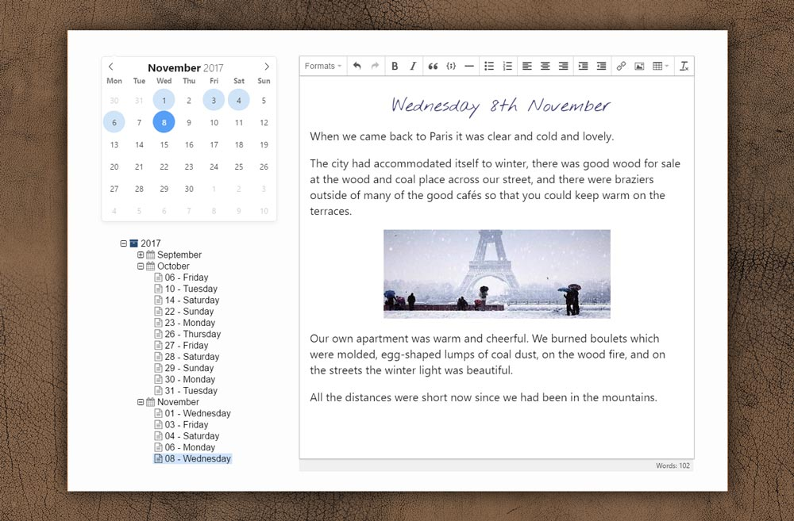

# Epic Journal

A free cross-platform encrypted daily journal / diary app, with full CSS styling. It is built with Sqlite3 and 
SQLcipher with AES 256 CBC encryption.

### ⭐⭐⭐ Update 2019-09-14 ⭐⭐⭐

I released the first version of Epic Journal in Nov 2017 after one month's coding experience.
As you can imagine, it was a bit rough around the edges...

I've been working on [a business project](https://www.easycrypto.nz/) since then and only just getting back into it now.
However I'm coming back with 2 years of coding experience, so this time it's serious! 🚀 

I've upgraded all the bits of framework to the latest versions and I've switched to @journeyapps/sqlcipher so we can now
 build for MacOS and Linux without any issues.

### Download
Download the [latest release here](https://github.com/alangrainger/epic-journal/releases/latest).

I built it as a free and open replacement for *The Journal* by DavidRM, which I have used 
for many years. The main issues I wanted to solve were better styling, and the ability to know that my
entries are safe for the long-term, with an open and known database format.

## Features

- Fast and clean Electron app
- AES 256 CBC encryption
- Single journal file that you can store in your Dropbox, or wherever you like
- Custom style types
- Pure HTML5 compatible
- Syntax highlighting
- Insertable templates
- Tagging
- Image support
- Active development

## Usage

[See the documentation here](https://epicjournal.xyz/docs/).

## Upcoming features

I'll be working towards feature parity with The Journal, but the next things I'm working on are:

- Mobile app (nothing fancy, just to add entries on the go)
- Search. Good fast search.
- Multiple folders. They will be tabs above the editor - think of them as master categories.
- Linking between entries
- Minimise to tray, and hotkey open
- Notes folder – i.e. non date-related entries
- Emoji support
